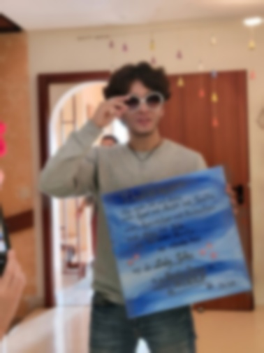
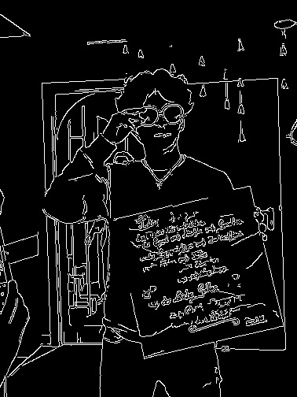
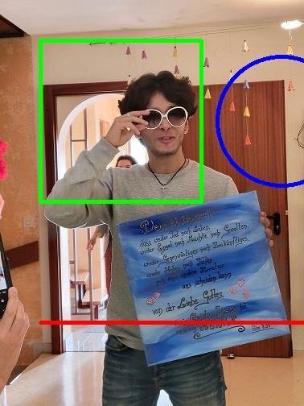
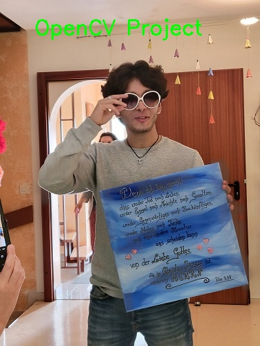
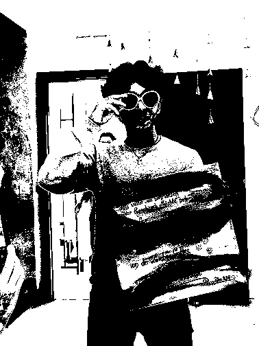
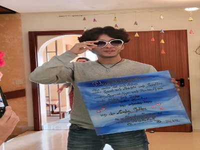
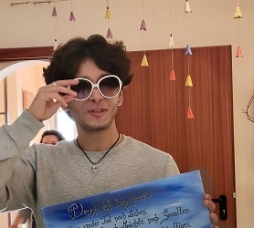

# Computer Vision Image Processing with OpenCV

This is a beginner-friendly computer vision project using Python and OpenCV.

## Project Overview

This project demonstrates basic image processing techniques using OpenCV.  
It includes reading an image, converting it to grayscale, detecting edges, drawing shapes, adding text, blurring, thresholding, resizing, and cropping.

The goal of this project is to practice fundamental computer vision and image processing concepts step by step.

## Features

- Read and display an image
- Convert an image to grayscale
- Detect edges using Canny Edge Detection
- Draw basic shapes on an image
- Add text to an image
- Apply Gaussian blur
- Apply binary thresholding
- Resize and crop an image
- Save processed images

## Technologies

- Python
- OpenCV

## Project Structure
computer-vision-image-processing-opencv/
│
├── images/
│   ├── axx.jpg
│   ├── axx_gray.jpg
│   ├── axx_edges.jpg
│   ├── axx_shapes.jpg
│   ├── axx_text.jpg
│   ├── axx_blur.jpg
│   ├── axx_threshold.jpg
│   ├── axx_resized.jpg
│   └── axx_cropped.jpg
│
├── 1_photo_display.py
├── 2_grayscale.py
├── 3_edge_detection.py
├── 4_draw_shapes.py
├── 5_add_text.py
├── 6_blur_image.py
├── 7_threshold_image.py
├── 8_resize_crop.py
├── requirements.txt
└── README.md

## How to Run

First, install the required package:
pip install -r requirements.txt

Then run one of the Python files:
python 1_photo_display.py

or:
python 3_edge_detection.py

## Output Examples

### Original Image

### Grayscale Image

### Edge Detection

### Draw Shapes

### Add Text

### Blur Image

### Threshold Image

### Resized Image

### Cropped Image

## What I Learned

Through this project, I practiced:

- Reading and displaying images with OpenCV
- Converting color images to grayscale
- Using Canny Edge Detection
- Drawing shapes and text on images
- Applying blur and thresholding
- Resizing and cropping images
- Saving processed images
- Organizing a small computer vision project for GitHub

## Purpose

The purpose of this project is to build a practical foundation in image processing and computer vision using OpenCV.

This project is part of my learning path in Computer Vision, Machine Learning, AI, and Robotics.
